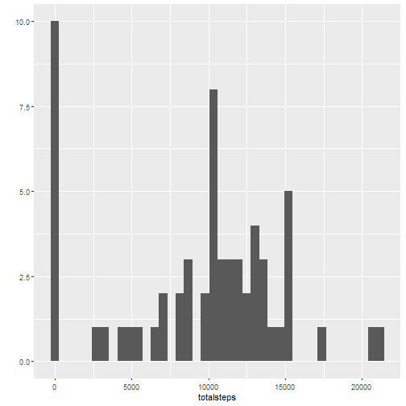
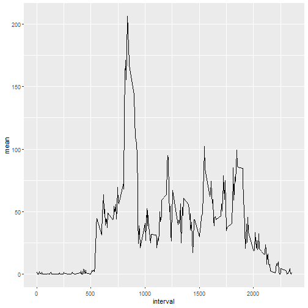
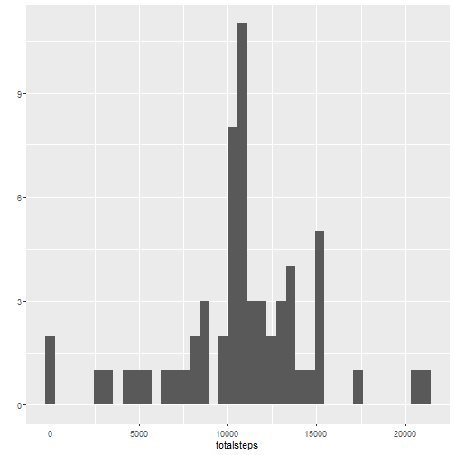
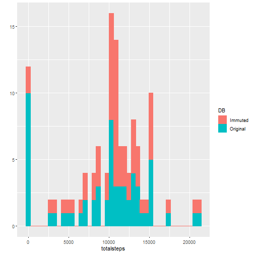
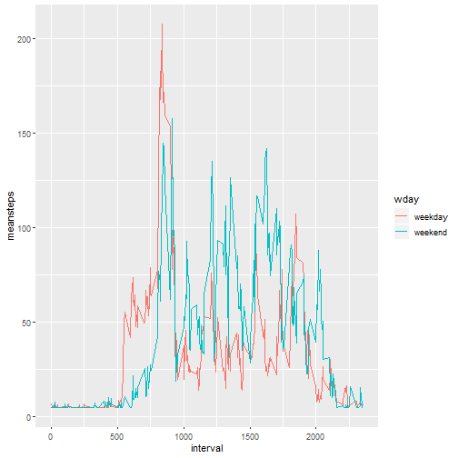

## Loading and preprocessing the data

```r
library(lubridate, dplyr)
library(ggplot2)
activity <- read.csv(unz("activity.zip", "activity.csv"), header = TRUE, stringsAsFactors = FALSE)
activity1 <- activity %>% mutate(date2 = ymd(date)) %>% group_by(date2)
tsteps <- activity1 %>% summarize(totalsteps = sum(steps, na.rm=TRUE))
```


## What is mean total number of steps taken per day?
1.  Calculate the total number of steps taken per day


```r
qplot(totalsteps, data = tsteps, geom = "histogram", bins = 40)
```



2.  Calculate and report the mean and median of the total number of steps taken per day


```r
summary(tsteps$totalsteps)
```

```
##    Min. 1st Qu.  Median    Mean 3rd Qu.    Max. 
##       0    6778   10395    9354   12811   21194
```

```r
omedian <- median(tsteps$totalsteps)
omean <- mean(tsteps$totalsteps)
```

The meadian total steps per day is 10395 and the mean total steps per day is 9354.2295082.


## What is the average daily activity pattern?

1.  Make a time series plot of the 5-minute interval (x-axis) and the average number of steps taken, averaged across all days (y-axis)


```r
msteps <- activity %>% group_by(interval) %>% 
    mutate(meansteps = mean(steps,na.rm=TRUE)) %>%
    summarize(mean = mean(steps, na.rm=TRUE))
qplot(interval, mean, data = msteps, geom="line")
```




1.  Which 5-minute interval, on average across all the days in the dataset, contains the maximum number of steps?

```r
meaninterval <- msteps[which.max(msteps$mean),1]
```
The 5-minute interval that contains the maximum number of steps starts with 835.

## Imputing missing values

1.  Calculate and report the total number of missing values in the dataset (i.e. the total number of rows with NAs)


```r
totalNA <-sum(is.na(activity$steps))
sum(is.na(activity$date))
```

```
## [1] 0
```

```r
sum(is.na(activity$interval))
```

```
## [1] 0
```

The number of missing values in the dataset is 2304. There are no missing values in the other columns.

2.  Devise a strategy for filling in all of the missing values in the dataset. The strategy does not need to be sophisticated. For example, you could use the mean/median for that day, or the mean for that 5-minute interval, etc.

It makes most sense to me to use the mean for the 5-minute interval as we have already calculated that.

3.  Create a new dataset that is equal to the original dataset but with the missing data filled in.


```r
activity2 <- activity %>% mutate(date2 = ymd(date), ) %>%    mutate(meansteps = mean(steps,na.rm=TRUE)) %>%
  mutate(wday = factor( ifelse(wday(date2)==1|wday(date2)==7, "weekend", "weekday")))
activity2$steps[is.na(activity$steps)] <- activity2$meansteps[is.na(activity$steps)]
```


4.  Make a histogram of the total number of steps taken each day and Calculate and report the mean and median total number of steps taken per day. Do these values differ from the estimates from the first part of the assignment? What is the impact of imputing missing data on the estimates of the total daily number of steps?

```r
activity2 <- activity2 %>%   group_by(date2)
tsteps2 <- activity2 %>% summarize(totalsteps = sum(steps))
qplot(totalsteps, data = tsteps2, geom='histogram', bins=40)
```




```r
dmean <- mean(activity2$steps)
dmedian <- median(activity2$steps)
```

The new mean number of steps per day is 37.3825996. The new median number of steps per day is 0.

To consider the impact of immuting the data, we will plot both histograms on top of each other.


```r
# We need to combine both data sets using a factor to clarify where the information is coming from.
tsteps <- activity1 %>% summarize(totalsteps = sum(steps, na.rm=TRUE))
tsteps <- mutate(tsteps, DB = "Original")
tsteps2 <- mutate(tsteps2, DB = "Immuted")
bothsteps <- rbind(tsteps, tsteps2)
qplot(totalsteps, data = bothsteps, geom = "histogram", colour = DB, fill = DB, bins=40)
```



It appears that there is little difference in the two data frames except when the total number of steps is zero. In this case the total number of steps being zero goes down in the Immuted data.  This can also be seen in the mean and median values which both go down.  The original mean was 9354.2295082 and immuted mean is 37.3825996.  The orignal median was 10395 and the immuted median is 0.


## Are there differences in activity patterns between weekdays and weekends?

1.  Create a new factor variable in the dataset with two levels – “weekday” and “weekend” indicating whether a given date is a weekday or weekend day.

```r
activity2 <- activity2 %>% mutate(wday = as.factor(wday))
```

2.  Make a panel plot containing a time series plot (i.e. \color{red}{\verb|type = "l"|}type="l") of the 5-minute interval (x-axis) and the average number of steps taken, averaged across all weekday days or weekend days (y-axis). See the README file in the GitHub repository to see an example of what this plot should look like using simulated data.

```r
pdata <- activity2 %>% group_by(wday, interval) %>%
    summarize(meansteps = mean(steps))
qplot(interval, meansteps, data = pdata, color = wday, geom="line")
```


